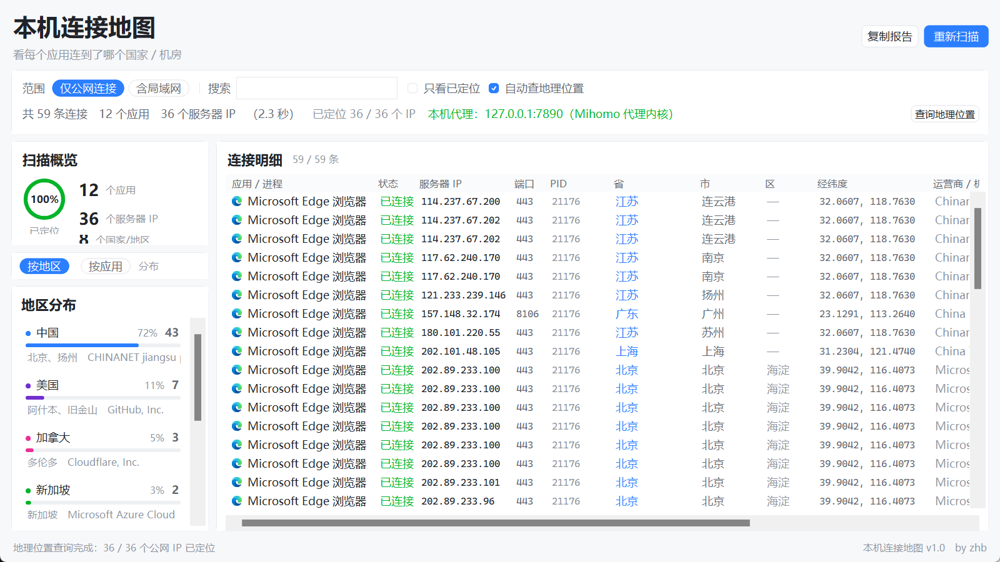
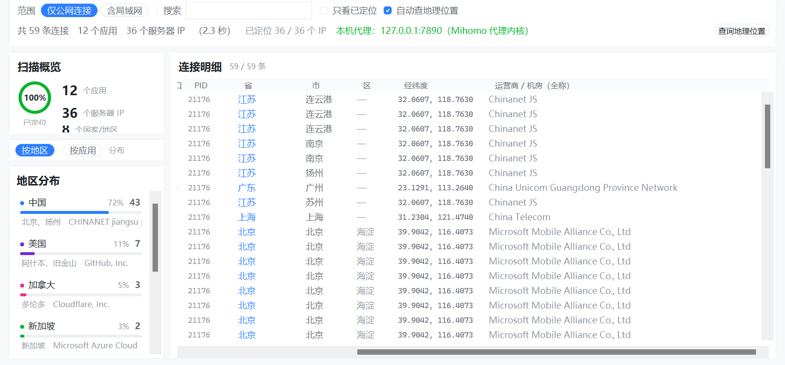

# 本机连接地图（ConnMap）

一个回答「**这台电脑到底在连谁**」的桌面工具。

它枚举本机**所有进程**（含系统组件）当前的网络连接，反查每个远端 IP 的
**地理位置**与**所属机房**，于是「某个软件连的服务器在日本」这件事可以直接看到，
而不是靠猜。

界面为浅色卡片式设计，与同系列的 `netdiagnose` 保持同一套视觉语言。



表格比窗口宽时拖横向滚动条即可，右侧是「经纬度」与完整机房名：



---

## 快速开始

**免安装版**：到 [Releases](https://github.com/xbzb404/ConnMap/releases/latest)
下载 `ConnMap.exe`，双击即用，无需装 Python。

**源码运行**（Windows，Python 3.10+）：双击 `启动连接地图.bat`，或：

```bash
python app.py
```

命令行自测（不启界面）：

```bash
python connscan.py                 # 列出所有公网连接（按进程分组）
python connscan.py --all           # 连局域网连接一起列
python geoloc.py 8.8.8.8 1.1.1.1   # 单查某几个 IP 的归属
python geoloc.py --cache-info      # 看地理缓存状态
python geoloc.py --clear-cache     # 清空缓存
```

---

## 它能看到什么

打开后自动扫描，每个应用一行，列出：

| 列 | 含义 |
|---|---|
| 应用 / 进程 | 发起连接的进程，**前面带程序真实图标**（常见软件会显示成人话名字，如 `msedge.exe` → Microsoft Edge 浏览器） |
| 状态 | 已连接 / 连接中 / 握手中 |
| 服务器 IP | 对端地址 |
| 端口 | 对端端口（并标注常见用途，如 443 → HTTPS 加密网页） |
| PID | 进程号，用于和其它工具（任务管理器、`tasklist`）对上 |
| 省 | 反查出的省 / 直辖市 / 自治区；国外 IP 显示其州 / 省（已中文化，如 加利福尼亚、东京都） |
| 市 | 反查出的城市（国外 IP 同样有） |
| 区 | 反查出的区 / 县；**仅国内 IP 有**，国外 IP 显示「—」 |
| 经纬度 | 该 IP 的坐标（`31.2304, 121.4740`，4 位小数约 11 米精度）。**本机 / 局域网连接不查地理，显示「—」** |
| 运营商 / 机房（全称） | 运营商或云机房名，并标注「云机房」/「CDN」。这一列**不截断、不缩写**，宽度按当轮最长值自动撑开 |

表格比窗口宽时拖底部的横向滚动条即可（表头会跟着一起滚，不会错列）。

**右键任意一行**可以打开该进程程序所在位置、直接打开程序，复制程序路径 /
进程名 / PID / 远端地址，以及**坐标相关的三项**：

| 菜单项 | 行为 |
|---|---|
| 打开文件所在位置 | 在资源管理器中打开该 exe 所在目录并选中它 |
| 打开程序 | 用系统默认方式打开该 exe |
| 复制程序路径 / 复制进程名 / 复制 PID / 复制远端地址 | 写入剪贴板 |
| 复制经纬度 | 复制紧凑坐标 `31.2304,121.4740`（无空格版，方便贴进地图或表格） |
| 复制完整地址 | 复制一行「IP　省 市 区　31.2304°N, 121.4740°E　运营商」 |
| 在地图上查看机房位置 | 用高德地图打点打开该坐标 |

没有拿到程序路径时（少数无路径权限的进程），前两项显示为灰色不可点；
IP 还没定位出坐标时，坐标三项显示为灰色不可点（不隐藏，免得以为菜单漏项）。

左侧面板给出**地区分布**与**应用分布**两条汇总轴，以及对每个地区（省 / 市 / 区）的占比条。
点某个地区即可只看该地区的连接。

工具栏第二行常驻显示**本机代理状态**（如 `本机代理：127.0.0.1:7890（Mihomo 代理内核）`）。
很多「地图上什么都看不到 / 只看到一堆连到国内的连接」的情形，根子就在于流量全被
本机代理接管了 —— 那一格会明确告诉你代理指在哪、是谁在提供。

实测效果（本机真实结果）：

| 应用 | 服务器 | 省 | 市 | 经纬度 | 机房 |
|---|---|---|---|---|---|
| NVIDIA 显卡服务 | 23.218.94.210 | 东京都 | 东京 | 35.6800, 139.7700 | Akamai Technologies `CDN` |
| Microsoft Edge | 48.210.190.78 | 东京都 | 东京 | 35.6800, 139.7700 | Microsoft Azure Cloud (japaneast) |
| Microsoft Edge | 140.82.114.25 | 加利福尼亚 | 旧金山 | 37.7749, -122.4194 | GitHub, Inc. |
| 代理内核 | 49.13.231.3 | 巴伐利亚 | 纽伦堡 | 49.4521, 11.0767 | Hetzner |
| 系统服务 | 4.145.79.82 | 新加坡 | 新加坡 | 1.2830, 103.8330 | Microsoft Azure (southeastasia) |
| 某个应用 | 101.101.101.101 | 中国台湾 | 台北 | 25.0329, 121.5654 | Twnic |
| 系统服务 | 183.2.172.17 | 广东 | 深圳 | 22.5455, 114.0540 | 中国电信 `云机房` |

---

## 功能

- **自动扫描 + 自动定位**：启动即出结果，无需手点。
- **边查边显示**：扫描完立刻把行铺出来，地理位置**查到哪个就填哪个**，
  进度环与状态栏逐条推进，不等整批查完。查过的行标「查询中…」，
  与「查不到」区分开。
- **经纬度列**：每个公网 IP 直接给出坐标，右键可复制坐标 / 完整地址，或在地图上打点
  打开机房位置。
- **机房名显示全称**：运营商 / 机房列**不截断、不缩写**，列宽按当轮真实最长值
  自动撑开，超宽就横向滚动（表头同步滚动）。
- **本机代理检测**：读出系统代理指向哪、是谁在提供（Clash / mihomo / v2rayN / sing-box…）、
  端口是否真的在监听，并在注册表两处存储不一致时给出告警。
- **程序图标 + PID**：进程列显示 exe 的真实图标；取不到图标时退成
  「首字母 + 稳定配色」的色块，不会留空白。
- **右键菜单**：打开程序所在位置 / 打开程序 / 复制路径、进程名、PID、远端地址、
  经纬度、完整地址 / 在地图上查看机房位置。
- **筛选**：范围三档（仅公网 / 含局域网 / 含本机）；**进程、IP、端口、关键词四个独立输入框**，
  可任意叠加，改一个字即刻生效。端口框纯数字按**精确匹配**（输入 `443` 不会把 `8443` 一起捞出来），
  带非数字才退化成子串匹配。另有「按地区点击筛选」。
- **本机监听端口看得见**：自己开的服务（七日杀 `26900`、开发用 Web 服务、数据库…）默认就在表里 ——
  TCP 的 `LISTENING` 与 UDP 的 `*:*` 统一归「监听」类，IP / 端口列显示**本机监听地址与本地端口**
  （不是 `0.0.0.0 / 0`），状态列标出 TCP / UDP 便于区分同号的两条。
- **两种汇总视角**：按地区 / 按应用，各自带占比条。
- **只看已定位**：过滤掉尚未查到归属的连接。
- **复制报告**：一键把「地区分布 + 本机代理 + 应用分布 + 连接明细（含经纬度）」整份报告
  复制到剪贴板。
- **磁盘缓存**：查过的 IP 会缓存 30 天，重复打开不再发请求，也不会被限流；
  缓存里若有解坏的文字会自动重跑清洗（见下文）。

---

## 诊断思路与关键取舍

### 只保留「真正在连接」的条目

`netstat -ano` 的输出里有大量噪音，直接展示会淹掉有用信息。工具做了三层过滤：

- **丢掉 TIME_WAIT / CLOSE_WAIT 等残留状态**。实测本机 46 条 TCP 记录里，
  一大半是已结束但还挂在表里的 TIME_WAIT，它们不代表「当前正在连的服务器」。
- **丢掉 PID 0 与 PID 4**。这俩是内核空闲进程与内核本身，`netstat` 会把系统级
  连接表项挂到它们下面，不对应任何用户应用。
- **范围三档，默认「含局域网」**。环回（`127.0.0.1`）与私网（`192.168.*`）大多是本机
  进程间通信、与「服务器在哪个国家」无关；但本机**开出去的服务**（游戏私服、开发用
  Web 服务）恰恰只出现在这里 —— 所以默认给到「含局域网」，想只看公网切回第一档。
- **监听项单独成一类**（`TCP LISTENING` / UDP `*:*`）。它们没有对端，归进「本机」会让人
  误以为是「自己连自己」，因此独立成类，并由「显示监听端口」开关控制收不收
  （默认收）。⚠️ UDP 的 `*:*` 必须在拆 `IP:端口` 时就拦掉：否则端口 `*` 转数字失败，
  整串 `*:*` 会被当成主机名返回，分类落进「未知」而被范围过滤吃掉 ——
  这正是「七日杀端口明明开着却搜不到」的直接原因。

### 地理位置用多库回退链

免费 IP 库没有一个是可靠的，这是实测结论：

- `ip-api.com` 字段最全（含中文、`isp`、`org`、`hosting` 标记），但免费档限
  **45 次/分钟**；而且本机网络对部分 IP（如 `8.8.8.8`）走 http 会直接超时。
- 淘宝、美团的公开接口：一个因未带 key 被限流，一个直接返回无数据。
- `ipinfo.io`、`ipapi.co`、`api.ip.sb`、`ipwho.is` 均可用，字段各有取舍。

所以按 `ip-api → ipwho.is → ip.sb → ipapi.co → ipinfo` 的顺序依次尝试，
第一个成功的就用。上表里 `4.145.79.82` 就是 ip-api 失败后由 `ipwho.is` 兜住的。

### 机房识别不能靠厂商名裸匹配

`Cloudflare`、`Akamai` 既做 CDN 也做别的一堆事；`Chinanet`、`Aliyun`、
`GitHub` 分别是骨干网、云主机、源站，**都不是 CDN**。
早期版本用厂商名裸匹配，结果「几乎每一行都标着 CDN」——典型的假阳性。
现在 CDN 判定要求命中具体 CDN 产品特征（`cloudfront`、`wangsu`、`kunlun` 等），
并且有排除名单（`aws ec2`、`aliyun computing`、`github` 等）兜底。

### 地区名要合规化

各库返回的写法五花八门：有的把台湾写成「中华民国」，有的写「Hong Kong SAR China」，
还有繁体（「澳大利亞」）与英文城市名（「Yangzhou」）。
统一规范成 **中国台湾 / 中国香港 / 中国澳门**，并做繁转简、城市名中文化。
另外正式国名「中华人民共和国」在日常展示里简称为「中国」。

### 缓存要带结构版本

改动机房/CDN 判定逻辑后，旧缓存里的 `is_cdn` 仍是老值，会让人以为「改了没生效」。
所以缓存结构带 `CACHE_VERSION`，改动识别规则时递增，旧条目自动重新推导。

---

## 界面与打包的坑

### Tk 的圆弧没有抗锯齿，必须超采样自绘

Tk 的 `create_oval` / `create_arc` **完全没有抗锯齿**，
`create_polygon(smooth=True)` 又只在 x 方向平滑、y 方向照样是阶梯。
表现就是进度环、圆角卡片、占比条边缘一圈**像素毛边**，看着很廉价。

解法是**超采样 + 降采样**：在 Pillow 画布上以 `SS = 4` 倍尺寸绘制，
再用 `LANCZOS` 缩回逻辑尺寸，转成 `PhotoImage` 贴到 Canvas 上。

```python
class SsPainter:      # 4 倍尺寸离屏画
    def rrect(self, ...): ...   # 圆角矩形
    def ring(self, ...):  ...   # 圆环（沿弧切多边形扇面，端点自然圆）
    def to_photo(self, master): ...   # LANCZOS 缩回 → ImageTk.PhotoImage
```

所有自绘控件（`Ring`/`Bar`/`Tag`/`Chip`/`RoundedFrame`/`FlatButton`/
`CheckBox`/`Dot`）都继承 `AaCanvas`，只实现 `_paint(p, w, h)`；
文字仍用 Tk 的 `create_text` 叠加（Tk 字体渲染本身就带抗锯齿，
走 Pillow 反而更丑）。Pillow 缺失时自动退回 Tk 离屏画布 + `subsample`。

两个细节：

- **角度方向相反**。Pillow 的角是顺时针为正、0° 在 3 点钟；
  Tk 的 `create_arc` 是逆时针为正。换算时要取负。
- **`ImageTk.PhotoImage` 有全局缓存坑**。反复创建同尺寸的 `PhotoImage`
  可能拿回一个已销毁的实例，表现为图时有时无。
  把返回值挂在控件上（`self._photo = img`）保活即可。

### 程序图标要用 `c_void_p` 接，不能用 `wintypes.HICON`

`ExtractIconExW` 的 `argtypes` 里若写 `wintypes.HICON`，
句柄会**静默返回 0**，图标全部拿不到且不报错。
必须用 `ctypes.c_void_p`，所有 GDI 句柄也一样。

取图标链路：`ExtractIconExW` → `GetIconInfo` → `GetObjectW`（拿宽高）
→ `GetDIBits`（`biHeight` 传**负数**得到自上而下的行序，32bpp）
→ BGRA 逐字节换成 RGBA。位图是全透明的像素要按 `a == 0 且有色` 补成不透明，
否则部分图标会整片透明。

**句柄必须回收**：`DestroyIcon` + 两个位图 `DeleteObject` +
`GetDC` 配对的 `ReleaseDC`，否则每扫一次泄漏一批。
按 `(路径, 尺寸)` 缓存后，50 次重复取只要 0.0045 秒（首次 0.01 秒拿 6 个）。

### 定列宽前必须开 DPI 感知，否则量出来的字宽偏小

本机缩放 150%。**不开 DPI 感知**时 `winfo_screenwidth` 报 1707（逻辑像素）、
`tkfont.Font.measure` 也会按逻辑像素量 —— 同一个 IPv4 地址量到 **98px**，
而开过 `SetProcessDpiAwareness(2)` 之后真实是 **165px**。
按 98 定了个 138px 的列宽，结果 `115.231.184.42` 在界面上真的被切成了
`115.231.184.` —— 而且因为 `reqwidth (104) < winfo_width (138)`，
Tk 一直报「完整」，查不出问题。

**凡是拿测量值去定布局尺寸的脚本/逻辑，第一步都要开 DPI 感知。**

### 列宽样本要从真实数据源取，不能手编

先前在探针里手写了 `"Windows 系统服务宿主机"`（210px）当 proc 列的最长值，
但这个字符串**在 `PROC_ALIASES` 里根本不存在**（真实是「Windows 系统服务宿主」192px）。
于是按 210px 定了列宽，白占 18px，把 `net` 列挤窄了 18px。
现在样本一律从真实来源取：

```python
samples["proc"] |= set(connscan.PROC_ALIASES.values())
samples["place"] |= set(geoloc.PLACE_CN.values()) | set(geoloc.TRAD_TO_SIMP.values())
samples["state"] |= {"已连接", "连接中", "握手中", "监听", "UDP"}   # 只放 _state_display 的输出
```

`state` 尤其容易搞错：`CLOSE_WAIT` / `ESTABLISHED` 这类原始 socket 状态
在 `collect()` 里就被过滤或映射成中文了，**根本不会出现在界面上**，
拿它们当样本会得出「state 列要 110px」的假结论。

### 超长文本要按像素截，不要按字符数截

`net` 列的值来自外部字符串，长度不可控。原来写 `net[:34]`，
中英混排下会截在半个词上，显示成 `PPLive(tianjin`（看着像渲染坏了），
而且中文 34 字与英文 34 字宽度差一倍，用同一个字符数上限必然一边浪费一边溢出。

改成 `fit_text()` 按**像素宽**二分截断并补省略号（`…`），
截断位置和单元格实际可用宽严格一致（都用 `w - 8`），
让「被截断」看起来是有意为之。

> 这一版之后的演进：`net` 列不再靠截断省地方，改为按真实最长值自动撑宽
> （见「尾列不截断：宽度交给数据自己决定」）。`fit_text()` 仍然保留，
> 但退化成了超上限时的止损兜底。

### 截断时要保住「末尾的标签」

`net` 列的值形如 `Huawei Cloud Service　[云机房]`，
**末尾的 `[CDN]` / `[云机房]` 才是这列真正有信息量的部分**，
而按常规从头截，标签恰好就是被砍掉的那一截。

所以单独写了 `fit_net_text()`：先给标签留位，再把名字压短。
两个坑：

* 分隔符可能是**全角空格**（`_network_display` 拼的），
  也可能是**半角空格**（上游库原始字段就带）—— 两种都要认，
  否则标签识别不出来，照样被砍掉。
* 名字若连一个字都放不下，不要输出 `…　[云机房]`（看着像出错），
  直接只给标签更干净。

> 现在它只在上限之外才被触发；常规情况下整表会先按最长值撑宽，
> 名字是完整显示的。

### 尾列不截断：宽度交给数据自己决定

`net` 列的值来自外部字符串，长度完全不可控：短的 `Chinanet` 只有 8 个字符，
长的 `Shenzhen Tencent Computer Systems Company Limited` 近 300px。
定点宽的结论只能是「截断」，而截掉的就是名字里最具体的部分。

现在改成**每轮渲染前按真实最长值量一次**（`_measure_net_width()`），
量出来多少就给多宽（下限 168px、上限 620px）。名字全称铺得下就铺，
铺不下就让整表变宽、拖横向滚动条 —— 表头与表体是同步滚动的，不会错列。

两个细节：

* **占位文字不参与量宽**。`查询中…` / `未定位（…）` 不是最终值，
  拿它们定宽会让表格先胖一圈再瘦回去。
* **顺序不能反**。必须先量宽、再铺行；先铺行后改宽就得整表重铺一遍，
  白白多花几百毫秒。

配套的 `fit_net_text()` 仍然保留，但降级成**兜底**：
只有超过 620px 上限时才补省略号，并按「优先保住末尾 `[CDN]` / `[云机房]` 标签」
的规则截。

### 坐标列宽必须实测，差 8px 就会被硬切

坐标显示形如 `26.5982, 106.7070`，看着只有 17 个字符，于是按 `122px` 定了列宽 ——
结果界面上显示成 `26.5982, 106`，后面那截没了，**而且没有省略号提示**
（非尾列是普通 `Label`，超出部分直接硬切，不会自动加 `…`）。

原因是等宽字体比想象中宽：本机选中的是 **Cascadia Mono**，8pt 下每个字符 **9px**，
17 个字符要 153px，再加单元格内边距 8px 就是 161px。

所以坐标列宽改成**用字体实测最坏情况**得出，不手估：

```python
_mono8 = _font_of(self.root, self.fonts["mono_sm"])
self.widths["coord"] = max(self.widths["coord"],
                           _mono8.measure("-89.9999, -179.9999") + 14)
```

样本取「纬度最大 `-89.9999`（8 字符）+ `, ` + 经度最大 `-179.9999`（9 字符）」
= 19 字符，任何真实取值都不会超出。

### 机房名显示不全会看着像「中文乱码」

有两个来源，都长得像编码坏了，但**不是渲染问题**：

1. **上游库返回的畸形地名**。`ip-api.com` 带 `lang=zh-CN` 时，
   `regionName` 会返回 `台湾省 or 台湾` 这种「两种写法用 `or` 拼起来」的串。
   界面上就是 `台湾省 or 台湾` —— 用户第一反应是「怎么乱码了」。
   现在 `clean_text()` 会在 `\s+or\s+` 处截断，只取第一种写法。

2. **中英混排 + 繁体**。`Central Singapore`、`堪薩斯城`、`費城`、`達拉斯`。
   分别靠地名映射表补 `central singapore → 新加坡`、以及 `_TRAD_CHARS` 繁转简解决。

还有一类是**真的要还原的乱码**：GBK 接口被按 UTF-8 解出来的串，
比如 `上海`（其实是「上海」）。判据是「含 U+FFFD，或含 C1 控制字符
（U+0080~U+009F），或含成片的拉丁扩展字符」。

还原的坑在于 **cp1252 的 0x80~0x9F 段不是 latin-1 映射**
（`€‚ƒ„…†‡ˆ‰Š‹ŒŽ''""•–—˜™š›œžŸ`），只按 `latin-1` 编码会直接抛异常、
按 `cp1252` 编码又会漏掉真正的 C1 控制字符。最终做法是 `_lenient_bytes()`：
码位 ≤ 0xFF 的按原值取，cp1252 专有符号查反查表回推，两种来源都能还原。

**改了清洗逻辑，旧缓存也得跟着生效。** 否则用户会看到「改了没用」——
缓存里的 `台湾省 or 台湾` 还在，因为它命中缓存就直接返回了。
所以 `_cache_get()` 会拒绝含 U+FFFD 的记录，并触发一次**整份缓存自清洗**
（`_ensure_cache_sanitized()`），对旧条目原地重跑一遍规范化。

### 本机代理要单独探，不能只看连接表

`collect(min_kind=NET_PUBLIC)` 为了聚焦「服务器在哪个国家」，
会把环回（`127.0.0.1`）与私网连接过滤掉 —— 于是代理本身反而看不见了。
而「地图上只有一堆国内连接」这种结果的成因，往往就是流量全被本机代理接管了。

所以另开了 `localproxy.py`，独立回答三件事：

| 问题 | 手段 |
|---|---|
| 系统代理指在哪 | 读 WinINET 的**两份**存储：传统值 + `Connections\DefaultConnectionSettings` 二进制块，并逐字段对拍 |
| 是谁在提供 | `netstat` 找环回地址上监听常见代理端口的进程，再按进程名匹配 Clash / mihomo / v2rayN / sing-box / Proxifier 等 |
| 真的在监听吗 | 监听表里有没有该端口。配了代理但端口没监听 = 代理软件挂了、系统设置还留着 → 标警告色 |

二进制块的布局在 `DefaultConnectionSettings` 里是
「`<I` 版本 + `<I` 写入计数 + `<I` 标志位」+ 三组「`<I` 字节数 + 内容」
（代理服务器 / 绕过列表 / PAC 地址），字符串按 GBK 解。
浏览器读的是这一份，**不是** `ProxyEnable` / `ProxyServer` ——
两份不一致时（`legacy_only` / `binary_only` / `server_diff`）会单独告警。

性能上，`find_listeners()` 走 `list_processes(with_paths=False)`，
只跑 `tasklist` 不触发 PowerShell（省 1~2 秒），整体约 0.3~0.5 秒，
放在扫描的同一个工作线程里做，不额外开线程。

### 省/市/区三列要装得下「规范化后」的真实最长值

做「地址精确到省市区」时，列宽的依据是**规范化之后**的显示值，不是上游库原始字符串。
原始值会被 `_norm_province` / `_norm_district` 去后缀：
`新疆维吾尔自治区 → 新疆`、`乌鲁木齐县 → 乌鲁木齐`。
量宽度的探针样本必须用规范化后的真值，否则会按根本不出现的长字符串定宽，
要么白占空间、要么真截断。

三列各自的最长真实值（已确认会由地理库正常返回）：
* **省** → `不列颠哥伦比亚`（加拿大卑诗省，126px）
* **市** → `阿姆斯特丹`（荷兰，90px）
* **区** → `乌鲁木齐`（国内经 PConline 补齐的区县，72px）

所以定宽 `province=138 / city=104 / district=84`，各留 4~6px 余量。
加上坐标列与按数据撑开的机房列，整表通常 1500px 上下，
超出可视区（1600 窗口约 1190px），继续走横向滚动。

⚠️ 一个坑：`TRAD_TO_SIMP` 是**国家名**表（印度尼西亚等），绝不能当城市样本，
否则会把国家名误当成城市量出假的最长宽，把 city 列凭空撑大。

### 并发「边查边填」不能用生成器 + `as_completed`

生成器里没法用 `as_completed`（会阻塞到全批完成，也就没有「边查边显示」了）。
改成：worker 把 `(ip, geo)` 塞进 `queue.Queue`，生成器按 `total` 次 `get()`，
每拿到一个就 `yield`，调用方立刻 `post` 到界面线程去填那一行。

表格填充是**增量**的：`ConnRow.refresh_geo()` 只 `configure()` 受影响的几个
单元格文本，不重建行——重建会让滚动位置跳走。整表重排只在全批完成时做一次。

### 跨线程更新界面必须走队列

工作线程里**不能**调 `root.after()`。窗口还没进 `mainloop()`（或用测试脚本
手动 `root.update()` 驱动）时，从子线程调 `after` 会抛
`RuntimeError: main thread is not in main loop`。

统一改成 `queue.Queue`：线程 `post(事件名, 数据)`，主线程按节拍
`pump_events()` 取出来派发。

### 表行容器要显式给高度

`ConnRow` 里的 `Frame` 只装 `place()` 定位的子控件，自身没有内容撑高，
被 `pack()` 进列表后会**塌成 0 高度**，整张表看起来是空的。
必须 `height=ROW_H` + `pack_propagate(False)`。

### 行内列起点要与表头严格同源

表头按各列标称宽度累加定位；行内单元格若用「上一列实际文字宽 + 间距」推进，
就会**逐列漂移**，越往右错得越多。
正确做法是行内也用同一份 `widths` 累加，只有首列（图标位）特殊处理文字起点。

### `Popen(["explorer", ...])` 会 `WinError 2`

裸名 `explorer` 在本环境的 PATH 里解析不到，`Popen` 直接抛
`FileNotFoundError [WinError 2]`，右键「打开文件所在位置」静默失效。
必须用 `%WINDIR%\explorer.exe` 绝对路径，且把
`/select,"<路径>"` 整段作为一个 argv 传（别拆开，逗号是它的语法）。

### `wmic` 被本环境安全策略拦掉

取进程可执行文件路径的传统做法是 `wmic process get ...`，但本环境**禁用 wmic**。
改用 PowerShell：

```powershell
Get-CimInstance Win32_Process |
  Where-Object { $_.ExecutablePath } |
  ForEach-Object { "$($_.ProcessId)|$($_.ExecutablePath)" }
```

注意两点：

- PowerShell **不能从 Bash 调**（会被安全策略拦），但**从 Python `subprocess`
  调完全正常**。
- 输出是 **UTF-16LE**，解码前要看 BOM 或 NUL 密度判别，直接 `utf-8` 会乱码。

### 验证打包产物时，可见性要在「长任务之前」先测

`_verify_exe.py` 探针用 `root.update()` 手动驱动、不进 `mainloop`。
此时若窗口从未被抬到前台（Windows 上被别的窗口压住），
`winfo_viewable` / `winfo_ismapped` 会读到 0，截图也只会得到**全黑**——
这是**探针环境的假象**，不是程序的问题。

判据要这么看：在构造完界面后立刻 `deiconify() + lift() + -topmost` 合成一次，
**先把可见性记下来**，再去跑扫描/定位；最终结论也只看「截图前刚测的那次」，
不要用跑完长任务之后的值。同时检查截图是否有多种颜色（`getcolors` 只有 1 种 = 全黑）。

---

## 文件结构

```
connmap/
├── app.py                  # 图形界面（Tkinter，超采样抗锯齿自绘圆角/按钮/卡片/圆环）
├── connscan.py             # 连接枚举引擎（netstat + tasklist + PowerShell 取路径）
├── geoloc.py               # 地理定位与机房识别（多库回退 + 流式返回 + 缓存 + 脏数据清洗）
├── localproxy.py           # 本机代理探测（WinINET 两份存储对拍 + 端口监听 + 代理进程）
├── winproc.py              # Windows 进程集成（图标抽取、文件定位、版本信息）
├── build_exe.py            # 打包成单文件 exe
├── tools/                  # 开发期验证脚本（均可从任意目录运行）
│   ├── make_icon.py        # 生成图标
│   ├── probe_gui.py        # GUI 自动化验证
│   ├── probe_align.py      # 列对齐校验
│   ├── probe_colwidth.py   # 每列装得下最长真实值 + 表头 + 整表宽度
│   ├── probe_dump_cells.py # 导出每个单元格实际渲染的文字 + 每行 geo 原始字段 + 报告全文
│   ├── probe_icon_align.py # 图标 x/y 与文字起点是否逐行一致
│   ├── probe_ipcol.py      # IP 列是否真被截断（像素级扫描）
│   ├── probe_menu.py       # PID / 图标 / 右键菜单接线校验
│   ├── probe_ring.py       # 概览卡截图（DPI 感知）
│   ├── probe_ringfit.py    # 环内文字是否装得下
│   ├── probe_shot.py       # 成品整窗截图（DPI 感知）
│   ├── probe_hscroll.py    # 横向滚动后尾列是否完整可见
│   ├── live_probe.py       # 流式显示与抗锯齿验证
│   ├── aa_test.py          # 抗锯齿像素级验证
│   └── verify_exe.py       # 打包产物验证
├── screenshots/            # 界面截图
├── 启动连接地图.bat         # 双击启动
├── geo_cache.json          # 地理缓存（运行后生成，不入库）
├── _shots/                 # 验证脚本的截图/导出输出（不入库）
└── dist/                   # 打包产物（不入库）
```

验证脚本可直接从任意目录运行，例如：

```bash
python tools/probe_gui.py        # 构建界面并自报可见性/几何尺寸
python tools/verify_exe.py       # 打包后验证 exe 能否真正显示界面
```

`connscan.py`、`geoloc.py`、`winproc.py` 都不依赖界面代码，可被其它脚本直接调用：

```python
import connscan, geoloc

conns = connscan.collect(min_kind=connscan.NET_PUBLIC)
geos = geoloc.lookup_many(connscan.public_ip_set(conns))
for c in conns:
    g = c.geo = geos.get(c.remote_ip, {})
    print(f"{connscan.human_proc_name(c.proc_name):<24}"
          f"{c.remote_hostport:<24}"
          f"{geoloc.describe_region(g):<18}"
          f"{geoloc.short_network(g)}")
```

---

## 打包

```bash
python build_exe.py
```

产物为 `dist/ConnMap.exe`（单文件，双击即用，无需安装 Python）。
当前体积约 21 MB（含 Pillow——抗锯齿自绘需要，见下文）。

两个本机特有的打包要点（已写进脚本）：

- 商店版 Python 的 Tcl/Tk 在 `<Python根>/tcl` 而非 `Lib/tcl`，PyInstaller 检测不到，
  打出的 exe 会**静默不出窗口**。必须 `--add-data <tcl>;tcl`。
- 本环境的删除钩子会把 PyInstaller 内部的 `os.remove` 重定向到回收站，
  导致构建中途失败并留下损坏 exe。构建子进程需设
  `CODEBUDDY_SAFE_DELETE_ENABLED=0`。

**还有一个坑值得单独说：`PIL` 绝不能排除。**

早期 `build_exe.py` 为了压体积把 `PIL` 写进了 `EXCLUDES`。加入超采样抗锯齿后，
这会导致 `app.py` 里的 `_HAS_PIL` 变成 `False`——**程序照常启动、不报错、功能正常**，
只是界面悄悄退回 Tk 原生绘制，进度环重新长出毛边。
「exe 能跑起来」完全测不出这种降级。

所以现在 `build_exe.py` 做了两件事：

1. 从 `EXCLUDES` 里去掉 `PIL`/`Pillow`，并显式 `--hidden-import` 上
   `PIL`、`PIL.Image`、`PIL.ImageDraw`、`PIL.ImageTk`
   （`ImageTk` 依赖的 `_imagingtk` 是 C 扩展，静态分析容易漏）。
2. 打包完成后跑一次**冻结自检**：临时打一个只 `import PIL.ImageTk` 的小 exe，
   跑起来断言输出 `PIL_OK`。失败会明确提示「界面会退回无抗锯齿绘制」。

代价是体积从 14.0 MB 涨到 21.1 MB。这是必要的：省下 7 MB 换来的是一个
静默失效的抗锯齿，用户只会觉得「怎么还是廉价」,而不会看到任何报错。

---

## 说明

- 数据全部来自本机命令（`netstat` / `tasklist` / PowerShell）与公开 IP 库查询，
  **不上传任何本地数据**。图标抽取用的是系统 `shell32`，不联网。
- 除界面截图脚本外仅依赖 Python 标准库；地理查询优先用系统自带 `curl`，
  找不到时降级为标准库直接建连。
- 目前针对 Windows 优化；其它平台保留回退分支（Pillow 缺失时自动切 Tk 离屏绘制、
  图标抽取整体跳过）。
- IP 地理定位为**推断值**，精度到城市/机房级别，不保证逐台准确；
  机房名取自各库的 `org` 字段，可用于判断「是云机房还是家宽」。
