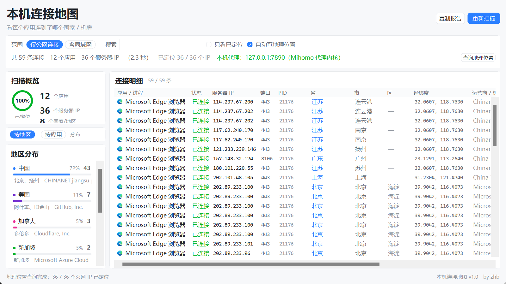
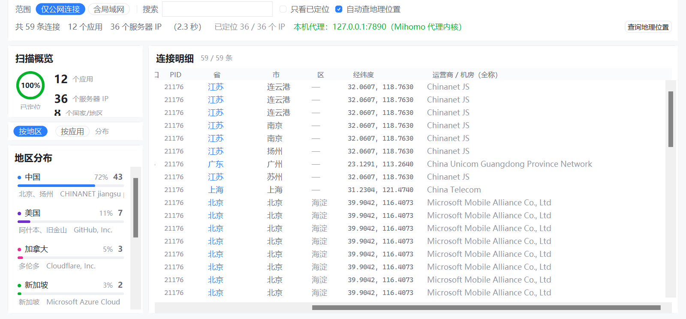

# 本机连接地图（ConnMap）

回答一个问题：**这台电脑到底在连谁。**

它枚举本机**所有进程**（含系统组件）当前的网络连接，反查每个远端 IP 的
**地理位置**与**所属机房**，于是「某个软件连的服务器在日本」这件事可以直接看到，
而不是靠猜。

界面为浅色卡片式设计，与同系列的 NetDiagnose 保持同一套视觉语言。



表格比窗口宽时拖横向滚动条即可，右侧是「经纬度」与完整机房名：



---

## 一、介绍

启动即自动扫描 + 自动定位，每个应用一行：

| 列 | 含义 |
|---|---|
| 应用 / 进程 | 发起连接的进程，前面带程序真实图标（常见软件显示成人话名字，如 `msedge.exe` → Microsoft Edge 浏览器） |
| 状态 | 已连接 / 连接中 / 握手中 / 监听 |
| 服务器 IP | 对端地址 |
| 端口 | 对端端口，并标注常见用途（如 443 → HTTPS 加密网页） |
| PID | 进程号，可与任务管理器、`tasklist` 对上 |
| 省 / 市 | 反查出的归属地；国外 IP 显示其州 / 省（已中文化，如 加利福尼亚、东京都） |
| 区 | 区 / 县；仅国内 IP 有，国外显示「—」 |
| 经纬度 | 该 IP 的坐标（4 位小数约 11 米精度）；本机 / 局域网连接显示「—」 |
| 运营商 / 机房（全称） | 运营商或云机房名，并标注「云机房」/「CDN」；不截断、不缩写，宽度随内容自动撑开 |

其它能力：

- **筛选**：范围三档（仅公网 / 含局域网 / 含本机），外加进程、IP、端口、关键词四个
  独立输入框，可任意叠加；端口框纯数字按精确匹配（输入 `443` 不会命中 `8443`）。
  另有「点表头排序」与「点地区筛选」。
- **汇总视角**：左侧按地区 / 按应用两条轴，各带占比条。
- **右键菜单**：打开文件所在位置、打开程序、复制程序路径 / 进程名 / PID / 远端地址、
  复制经纬度、复制完整地址、在地图上查看机房位置。
- **本机代理检测**：工具栏常驻显示系统代理指向哪里、是谁在提供、端口是否真的在监听。
- **本机监听端口看得见**：自己开的服务（游戏私服、开发用 Web 服务、数据库…）默认就在表里。
- **只看已定位**、**复制报告**（一键把整份报告复制到剪贴板）。
- **磁盘缓存**：查过的 IP 缓存 30 天，重复打开不再发请求，也不会被限流。

---

## 二、使用方法

**免安装版**：到 [Releases](https://github.com/xbzb404/ConnMap/releases/latest)
下载 `ConnMap.exe`，双击即用，无需装 Python。

**源码运行**（Windows，Python 3.10+）：双击 `启动连接地图.bat`，或：

```bash
python app.py
```

**命令行自测**（不启界面）：

```bash
python connscan.py                 # 列出所有公网连接（按进程分组）
python connscan.py --all           # 连局域网连接一起列
python geoloc.py 8.8.8.8 1.1.1.1   # 单查某几个 IP 的归属
python geoloc.py --cache-info      # 看地理缓存状态
python geoloc.py --clear-cache     # 清空缓存
```

**打包**：

```bash
python build_exe.py
```

产物为 `dist/ConnMap.exe`（单文件，约 21 MB，双击即用）。

`connscan.py`、`geoloc.py`、`winproc.py` 都不依赖界面代码，可被其它脚本直接调用：

```python
import connscan, geoloc

conns = connscan.collect(min_kind=connscan.NET_PUBLIC)
geos = geoloc.lookup_many(connscan.public_ip_set(conns))
for c in conns:
    g = c.geo = geos.get(c.remote_ip, {})
    print(f"{connscan.human_proc_name(c.proc_name):<24}"
          f"{c.remote_hostport:<24}"
          f"{geoloc.describe_region(g):<18}"
          f"{geoloc.short_network(g)}")
```

---

## 三、原理

### 连接枚举

数据来自本机 `netstat -ano`（TCP / UDP 全表）与 `tasklist` 取进程名，需要进程路径时走
PowerShell `Get-CimInstance Win32_Process`。进程图标用系统 `shell32` 的
`ExtractIconExW` 抽取，不联网。

原始表里有大量噪音，做了三层过滤：丢掉 `TIME_WAIT` / `CLOSE_WAIT` 等残留状态、
丢掉 PID 0 与 PID 4（内核空闲进程与内核本身）、按范围开关决定是否保留环回与私网
（默认「含局域网」，因为本机开出去的服务只出现在这里）。TCP `LISTENING` 与 UDP `*:*`
归为独立的「监听」类，避免被误读成「自己连自己」。

### 地理位置查询

免费 IP 库没有一个是可靠的，所以按 `ip-api → ipwho.is → ip.sb → ipapi.co → ipinfo`
的顺序依次回退，第一个成功的即采用。

结果**流式返回**：每查到一个就立刻填进对应行，不等整批完成。线程把 `(ip, geo)` 塞进
`queue.Queue`，生成器按总数逐个取出并投递到界面线程；表格填充是增量的，只改受影响的
几个单元格，不重建行，滚动位置不会跳。

返回的文本还要过一遍归一化：截断 `台湾省 or 台湾` 这类畸形串、繁转简、城市名中文化、
把 GBK 被按 UTF-8 解出的乱码还原；地区写法统一规范为**中国台湾 / 中国香港 / 中国澳门**。
缓存结构带版本号，识别规则改动后旧条目会自动重新推导。

### 机房与 CDN 判定

厂商名裸匹配会产生大量假阳性 —— `Cloudflare`、`Akamai` 既做 CDN 也做别的事，
`Chinanet`、`Aliyun`、`GitHub` 分别是骨干网、云主机、源站，都不是 CDN。
因此 CDN 判定要求命中具体的产品特征（`cloudfront`、`wangsu`、`kunlun` 等），
并配一份排除名单兜底。

### 本机代理探测

代理连接会被范围过滤挡掉，看不见代理本身，所以 `localproxy.py` 独立回答三件事：

| 问题 | 手段 |
|---|---|
| 系统代理指在哪 | 读 WinINET 的**两份**存储：传统值 + `Connections\DefaultConnectionSettings` 二进制块，逐字段对拍 |
| 是谁在提供 | `netstat` 找环回地址上监听常见代理端口的进程，按进程名匹配 Clash / mihomo / v2rayN / sing-box 等 |
| 真的在监听吗 | 监听表里有没有该端口；配了代理但没监听 → 代理软件已退出，标警告色 |

浏览器读的是二进制块那一份，**不是** `ProxyEnable` / `ProxyServer`，两份不一致时单独告警。

### 界面渲染

Tk 的 `create_oval` / `create_arc` 没有抗锯齿，自绘控件会有一圈像素毛边。所有圆角卡片、
进度环、按钮、占比条都走**超采样**：在 Pillow 画布上按 4 倍尺寸绘制，再用 `LANCZOS`
缩回逻辑尺寸转成 `PhotoImage`。文字仍用 Tk 的 `create_text` 叠加（Tk 字体渲染本身带
抗锯齿）。Pillow 缺失时自动退回 Tk 离屏画布 + `subsample`。

跨线程更新统一走 `queue.Queue`：工作线程 `post(事件, 数据)`，主线程按节拍取出派发，
不直接调 `root.after()`。

### 文件结构

```
ConnMap/
├── app.py                  # 图形界面（超采样抗锯齿自绘圆角/按钮/卡片/圆环）
├── connscan.py             # 连接枚举引擎（netstat + tasklist + PowerShell 取路径）
├── geoloc.py               # 地理定位与机房识别（多库回退 + 流式返回 + 缓存 + 脏数据清洗）
├── localproxy.py           # 本机代理探测（WinINET 两份存储对拍 + 端口监听 + 代理进程）
├── winproc.py              # Windows 进程集成（图标抽取、文件定位、版本信息）
├── build_exe.py            # 打包成单文件 exe
├── tools/                  # 开发期验证脚本
├── screenshots/            # 界面截图
└── 启动连接地图.bat         # 双击启动
```

### 说明

- 数据全部来自本机命令（`netstat` / `tasklist` / PowerShell）与公开 IP 库查询，
  **不上传任何本地数据**。
- 除界面截图脚本外仅依赖 Python 标准库；地理查询优先用系统自带 `curl`，
  找不到时降级为标准库直接建连。
- 目前针对 Windows 优化；其它平台保留回退分支。
- IP 地理定位为**推断值**，精度到城市 / 机房级别，不保证逐台准确。
